# System wykrywania intruzów

Desktopowa aplikacja do monitoringu wielu kamer i plików wideo, oparta o modele YOLO. System wykrywa osoby, rozróżnia tryb dzienny i nocny, oznacza potencjalnych intruzów, zapisuje klipy zdarzeń oraz pozwala konfigurować źródła obrazu, maski ignorowanych obszarów i parametry modelu bez ręcznego grzebania w kodzie.

Projekt składa się z aplikacji inferencyjnej PyQt6 oraz skryptów do przygotowania danych i treningu modelu.

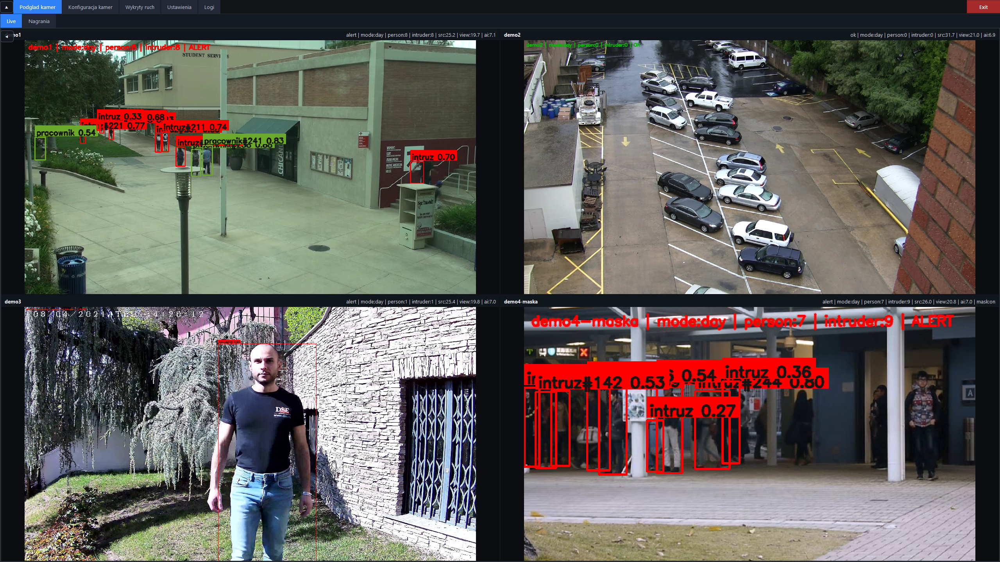

## Najważniejsze możliwości

- Obsługa wielu źródeł obrazu: kamery lokalne, pliki wideo i strumienie.
- Detekcja osób modelem YOLO oraz śledzenie obiektów między klatkami.
- Tryb dzień/noc z osobnymi regułami alarmu.
- W trybie dziennym możliwość odróżniania pracownika od intruza na podstawie zaprogramowanego wzorca ubioru.
- Obsługa masek, czyli obszarów kadru ignorowanych przez AI.
- Podgląd live w siatce kamer oraz tryb pełnoekranowy dla pojedynczego źródła.
- Archiwizacja wykryć do klipów wideo z pre-bufferem, czasem widoczności i cooldownem.
- Zakładka wykrytego ruchu z filtrowaniem zdarzeń, podglądem i otwieraniem zapisanych plików.
- Panel ustawień do zmiany progów detekcji, modeli, FPS, zapisu zdarzeń i kolorów ubioru.
- Logi aplikacji z możliwością eksportu.
- Skrypty do pobrania/przygotowania datasetu COCO `person` i treningu YOLO.

## Jak działa aplikacja

Aplikacja pracuje w osobnym oknie PyQt6. Podgląd kamer działa niezależnie od inferencji AI: UI może odświeżać obraz płynnie, a model analizuje najnowsze dostępne klatki zgodnie z limitem FPS. Dzięki temu stare klatki nie są kolejkowane, a opóźnienie podglądu pozostaje niskie.

W trybie nocnym każda wykryta osoba może zostać potraktowana jako intruz. W trybie dziennym system może dodatkowo używać modelu segmentacji osoby, wycinać sylwetkę i porównywać kolor górnej oraz dolnej części ubioru z ustawionym wzorcem pracownika. Osoby niepasujące do wzorca są oznaczane jako `intruz`.

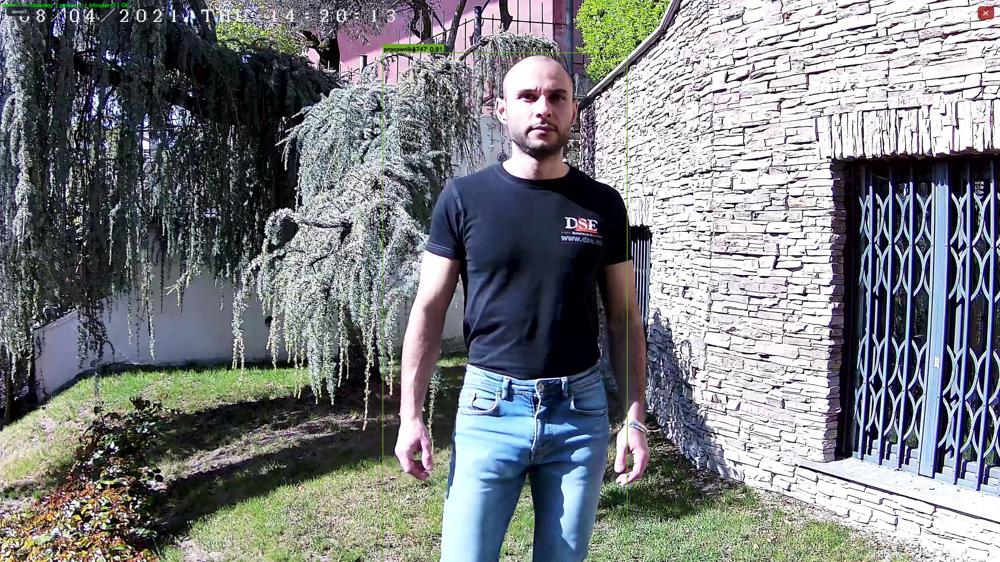

## Ekrany aplikacji

### Podgląd kamer

Zakładka podglądu pokazuje wszystkie aktywne źródła w siatce. Na obrazie widoczne są ramki detekcji, etykiety `pracownik`/`intruz`, liczba osób, liczba intruzów, tryb pracy oraz metryki `src`, `view` i `ai`.

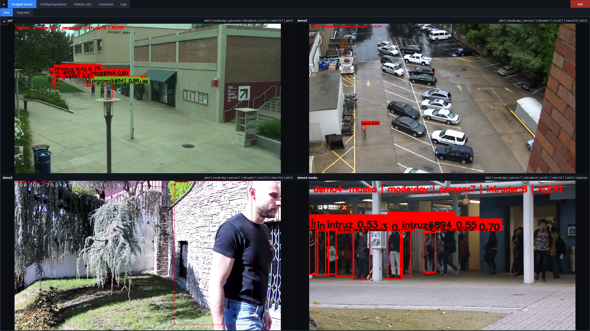

### Konfiguracja kamer

W zakładce konfiguracji można dodawać źródła, włączać i wyłączać kamery, ustawiać start od losowego momentu dla wideo oraz zapisywać konfigurację. Źródła są przechowywane poza głównym plikiem `inference.yaml`, w katalogu ustawień aplikacji.

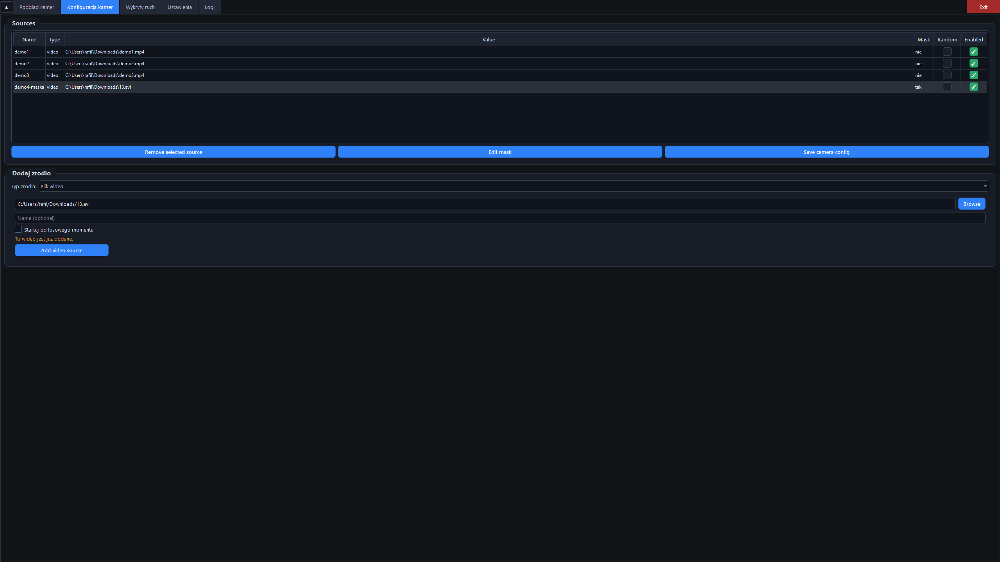

### Maski ignorowanych obszarów

Dla źródła można ustawić maskę obszaru, którego model nie powinien analizować. To przydatne, gdy fragment kadru stale powoduje fałszywe alarmy albo nie powinien brać udziału w detekcji.

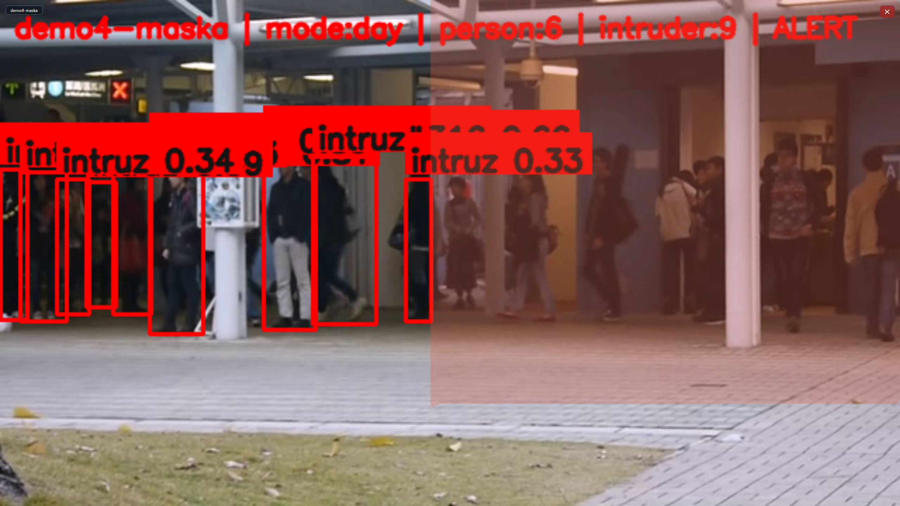

### Wykryty ruch

Zakładka `Wykryty ruch` prezentuje zapisane zdarzenia. Dostępne są filtry po okresie, trybie, kamerze, konkretnym dniu i godzinach. Po wybraniu wpisu aplikacja pokazuje podgląd zapisanego klipu lub obrazu.

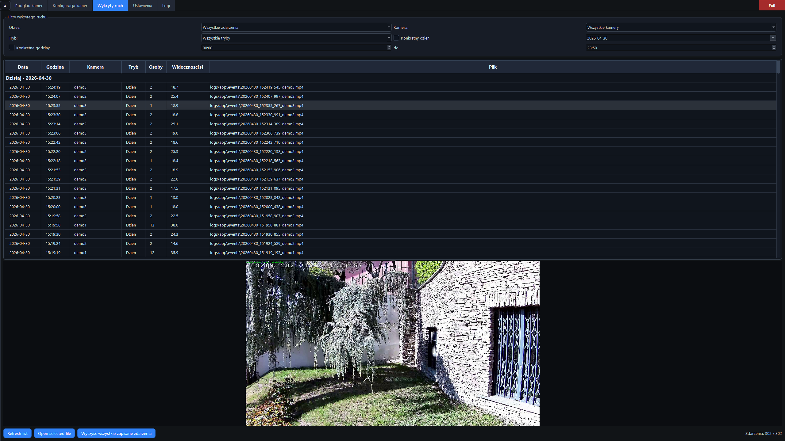

### Ustawienia

Panel ustawień pozwala zmienić reguły alarmu, archiwizację zdarzeń, profil detekcji YOLO, modele dzienne/nocne, urządzenie GPU/CPU, FP16, kompilację Torch oraz wzorzec ubioru dziennego.

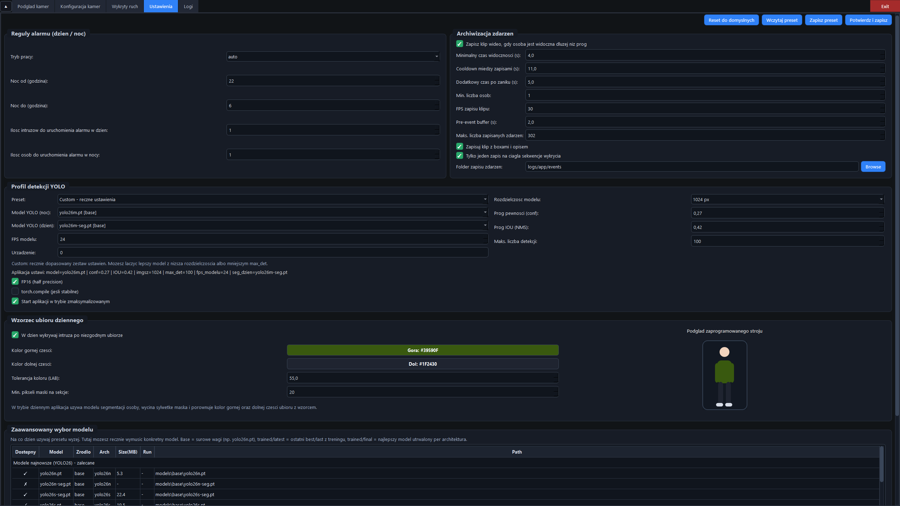

### Logi

Zakładka logów pokazuje komunikaty runtime: ładowanie modeli, start/stop źródeł, zapis zdarzeń, zmiany ustawień i ostrzeżenia. Logi można wyczyścić albo wyeksportować do pliku.

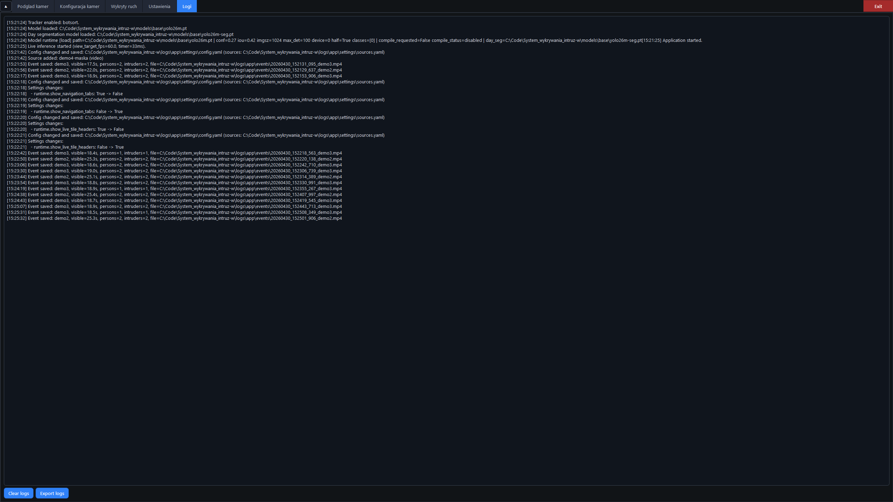

## Modele i profile pracy

Konfiguracja inferencji znajduje się w `config/inference.yaml`. Aplikacja obsługuje profile YOLO:

- `low`: szybki profil dla słabszego sprzętu lub wielu kamer.
- `medium`: balans między dokładnością i płynnością.
- `high`: wyższa dokładność kosztem FPS.
- `custom`: ręcznie dobrany model, rozdzielczość, progi i limity detekcji.

Aktualna konfiguracja używa między innymi:

- modelu nocnego `yolo26s.pt`,
- modelu dziennego segmentacji `yolo26s-seg.pt`,
- klasy `person`,
- GPU `device: '0'`,
- FP16,
- BoT-SORT jako trackera,
- automatycznego trybu dzień/noc w godzinach 22:00-06:00,
- zapisu zdarzeń do `logs/app/events`.

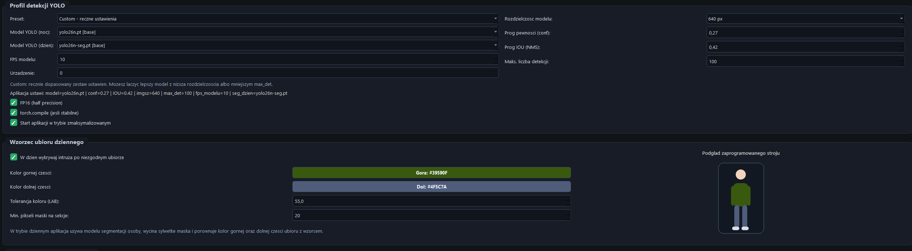

Przykład pracy na lżejszym modelu pokazuje, jak aplikacja zachowuje płynny podgląd przy niższym koszcie obliczeniowym.

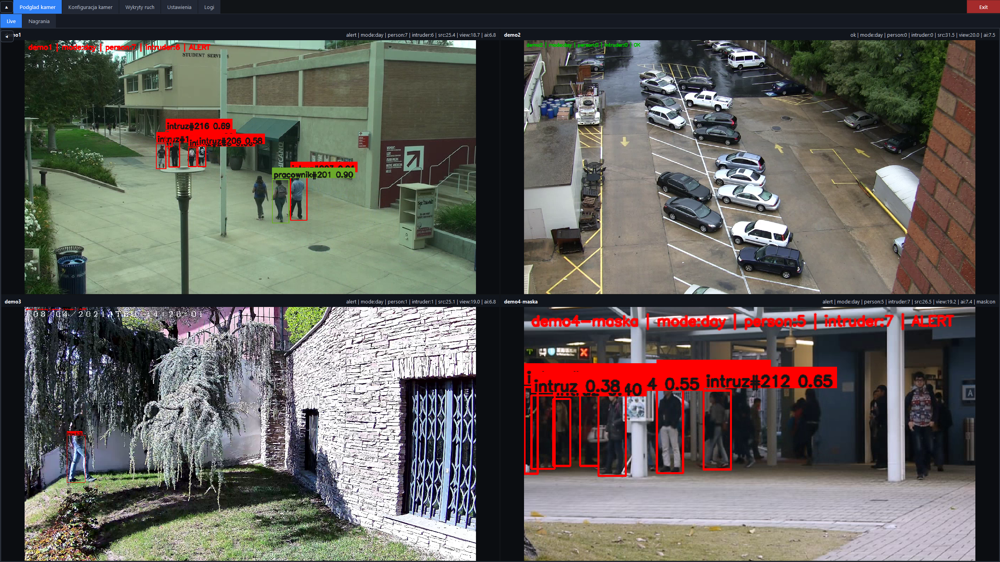

Po ręcznej zmianie ustawień można zwiększyć rozdzielczość modelu, zmienić progi detekcji i dobrać wariant modelu do jakości nagrania.

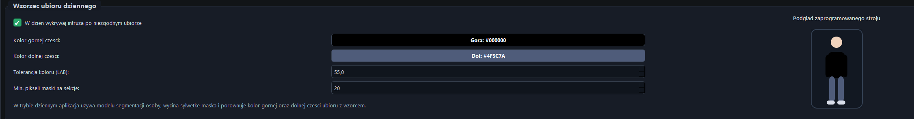

## Wydajność

Wydajność zależy od modelu, rozdzielczości `imgsz`, liczby źródeł i GPU. Lżejsze modele pozwalają utrzymać wyższy FPS, a większe modele poprawiają detekcję kosztem obciążenia.

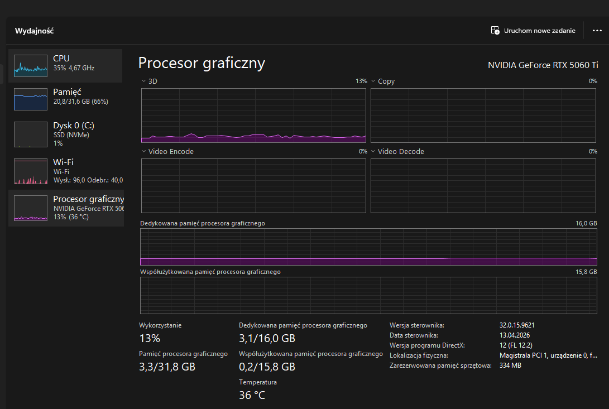

Przy wyższych ustawieniach detekcji rośnie obciążenie GPU/CPU, szczególnie przy większej rozdzielczości i wielu źródłach.

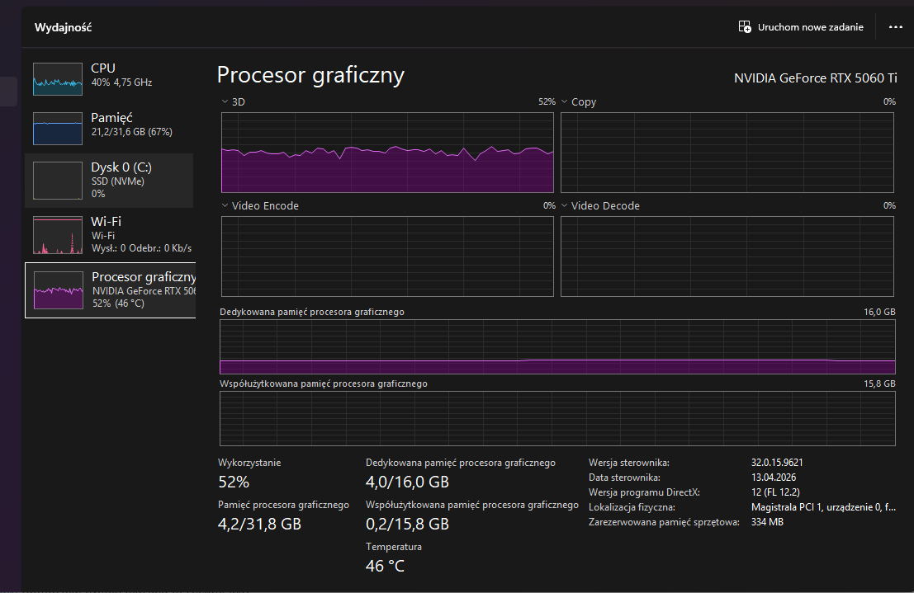

## Instalacja

Projekt był przygotowany pod Windows i CUDA. Wymagania są w `requirements.txt`.

```bash
python -m venv .venv
.venv\Scripts\activate
python -m pip install --upgrade pip
pip install -r requirements.txt
```

Szybka weryfikacja CUDA:

```bash
python -c "import torch; print(torch.__version__, torch.cuda.is_available(), torch.cuda.get_device_name(0) if torch.cuda.is_available() else 'CPU')"
```

Jeżeli `torch.cuda.is_available()` zwraca `False`, środowisko używa CPU albo zainstalowana wersja PyTorch nie pasuje do sterownika/CUDA.

## Uruchomienie aplikacji

```bash
python scripts/inference_app.py --config config/inference.yaml
```

Skanowanie dostępnych kamer:

```bash
python scripts/inference_app.py --config config/inference.yaml --scan-cameras
```

Po uruchomieniu aplikacja może automatycznie wystartować w pełnym ekranie, zależnie od ustawień:

```yaml
runtime:
  auto_start_live: true
  start_fullscreen: true
  start_maximized: true
```

## Zapis zdarzeń

Zdarzenie jest zapisywane, gdy osoba lub intruz jest widoczny dłużej niż ustawiony próg. System zapisuje klip wideo, może dodać ramki z opisem i używa pre-bufferu, aby klip zawierał moment sprzed właściwego alarmu.

Najważniejsze opcje:

```yaml
events:
  enabled: true
  min_visible_seconds: 4.0
  cooldown_seconds: 11.0
  linger_seconds: 5.0
  clip_fps: 30
  prebuffer_seconds: 2.0
  max_saved_events: 302
  save_annotated_frame: true
  output_dir: logs/app/events
```

Indeks zdarzeń jest zapisywany razem z plikami, dzięki czemu zakładka `Wykryty ruch` może je filtrować i odtwarzać.

## Trening modelu

Repozytorium zawiera pipeline do przygotowania datasetu i treningu YOLO na klasie `person`.

Konfiguracje:

- `config/dataset.yaml`: pobieranie i przygotowanie podzbioru COCO.
- `config/train.yaml`: model, hiperparametry, augmentacje, batch auto-search i eksport wag.
- `scripts/prepare_dataset.py`: przygotowanie danych.
- `scripts/training.py`: trening modelu.

Uruchomienie treningu:

```bash
python scripts/training.py --config config/train.yaml
```

Po treningu skrypt zapisuje wagi w logach runa oraz eksportuje najlepsze modele do `models/weights/`.

## Struktura projektu

```text
config/
  dataset.yaml        konfiguracja przygotowania datasetu
  inference.yaml      konfiguracja aplikacji inferencyjnej
  train.yaml          konfiguracja treningu
docs/                 screeny aplikacji użyte w README
logs/                 logi treningu i działania aplikacji
models/               wagi bazowe i wytrenowane
scripts/
  inference_app.py    aplikacja desktopowa PyQt6
  prepare_dataset.py  przygotowanie danych
  training.py         trening YOLO
  utils/              moduły pomocnicze
```

## Najważniejsze zależności

- `ultralytics` - YOLO, tracking i modele detekcji/segmentacji.
- `torch`, `torchvision`, `torchaudio` - backend deep learning.
- `opencv-python` - odczyt kamer, strumieni i wideo.
- `PyQt6` - interfejs desktopowy.
- `lap` - zależność używana przez trackery.
- `numpy`, `pandas`, `matplotlib`, `pyyaml`, `tqdm` - narzędzia pomocnicze.

## Licencja

Projekt jest udostępniony na warunkach licencji z pliku `LICENSE`.
